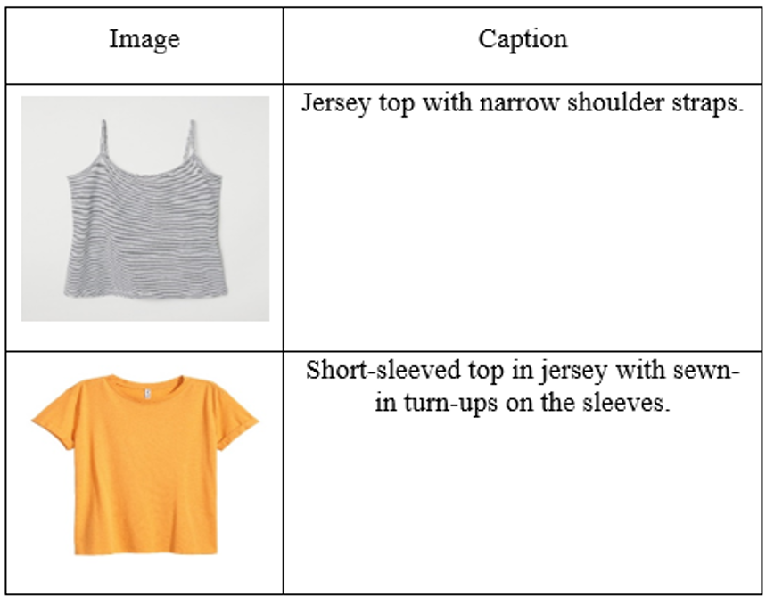
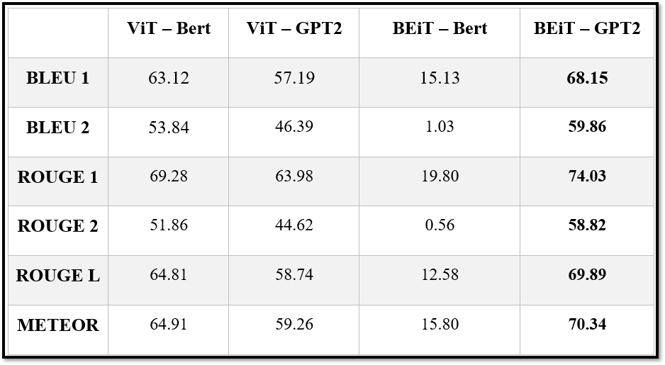
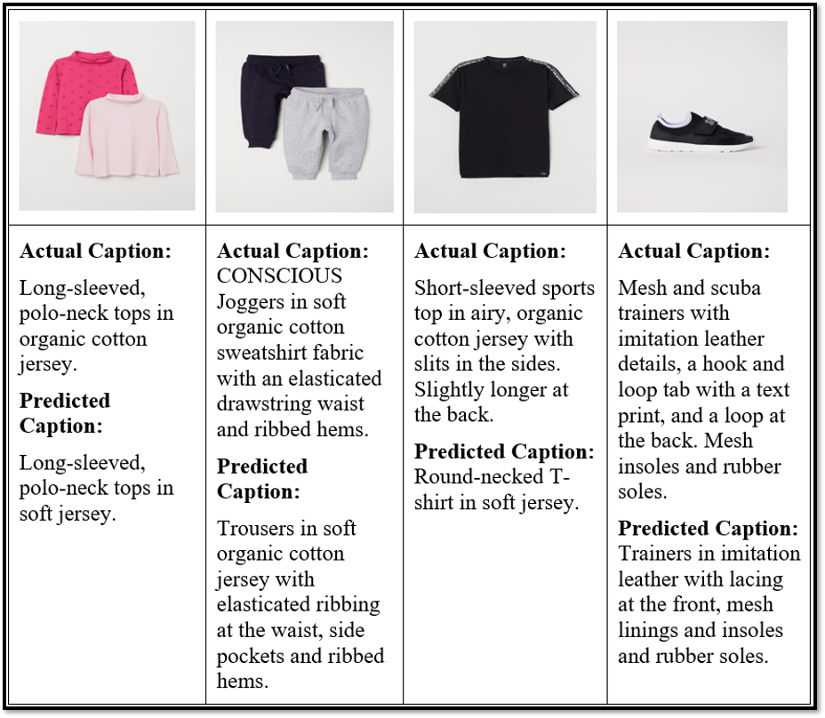

# Fashion Image Captioning

This project generates captions for fashion images using Transformer-based models.

## Dataset

The project uses the **Fashion Captioning Dataset (FACAD)**, which contains:
- **993K** high-resolution images
- **130K** detailed fashion-related captions
- **990 attributes & 78 categories** for classification
- **20,000** images used for training and testing

### Example Input:


## Methodology

Different **Encoder-Decoder** models were tested to find the best combination.

- **Encoders:** ViT, BEIT, DEIT  
- **Decoders:** BERT, DistilBERT, GPT2, DistilGPT2, RoBERTa  

Evaluation metrics used:
- **BLEU (1,2,3,4)**
- **ROUGE (1,2,L,S)**
- **METEOR**

## Results


Best model: **BEIT-GPT2**  
Achieved highest performance across BLEU, METEOR, and ROUGE scores.


## Project Structure

- `clean_text_data.ipynb` – Preprocessing text data  
- `prepare_dataset.ipynb` – Dataset preparation  
- `image-caption-{encoder}-{decoder}.ipynb` – Model training scripts  

## How to Run

1. Install dependencies:

   ```bash
   pip install torch transformers datasets nltk
   ```

2. Prepare dataset:

   Run `prepare_dataset.ipynb` to load and preprocess FACAD.

3. Train models:

   Open any `image-caption-{encoder}-{decoder}.ipynb` and execute all cells.

4. Evaluate results:

   Compare generated captions with actual captions.

## Example Output


